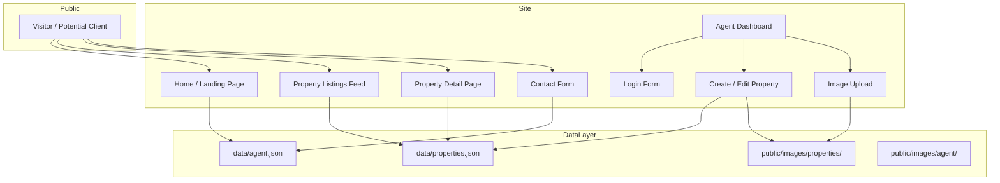
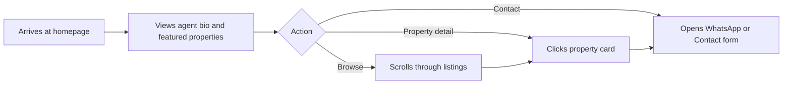
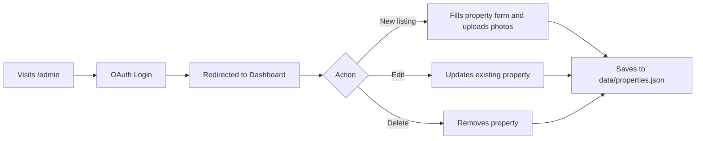
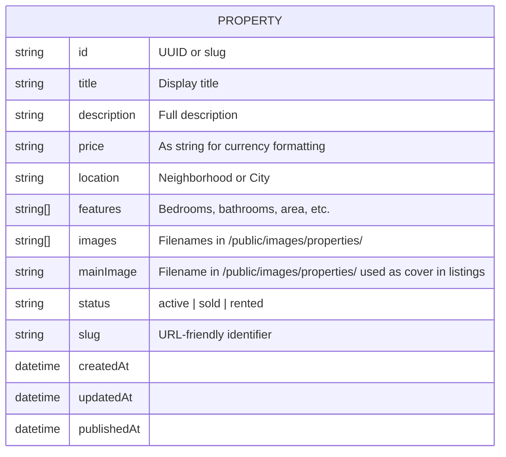
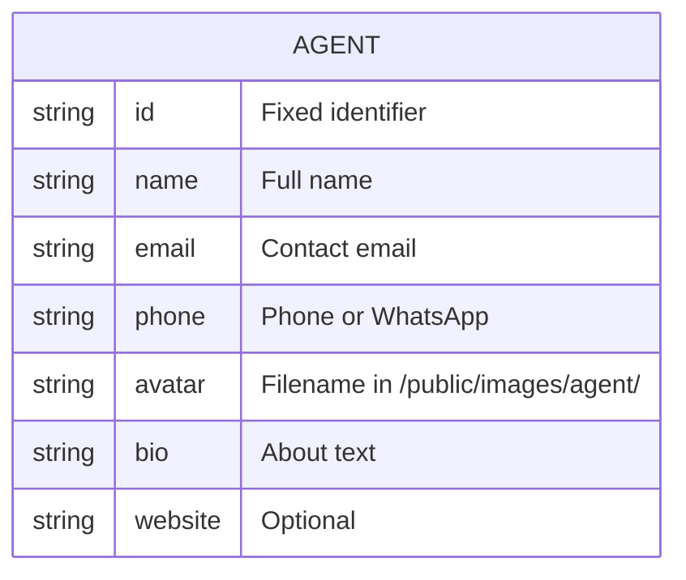

# Architecture

## Overview

This project is a **single-agent real estate website** — a clean, minimal online presence where an agent can:
- Publish property listings with photos and descriptions
- Share a public homepage (like a personal landing page)
- Manage all content through a simple admin dashboard

There is **no database, no paid back-end, and no server-side complexity**. All data lives in **JSON files** and images in the **filesystem**.

---

## System Architecture



---

## User Flows

### 1. Visitor Flow



### 2. Agent Flow



---

## Data Model

### Property



**Note:** A future edit-view antenna selector UI will let the agent choose the cover image from the gallery.

### Agent



---

## Folder Structure

```
imobiliario/
├── docs/                      # Documentation
│   ├── architecture.md
│   ├── tech-stack.md
│   └── implementation-plan.md
├── public/                    # Static assets
│   ├── images/
│   │   ├── agent/             # Agent profile photos
│   │   └── properties/        # Property photos
│   └── favicon.ico
├── src/
│   ├── components/            # Reusable UI components
│   │   ├── Header.astro
│   │   ├── Footer.astro
│   │   ├── PropertyCard.astro
│   │   ├── ContactForm.astro
│   │   └── AdminLayout.astro
│   ├── layouts/               # Page layouts
│   │   ├── MainLayout.astro   # Public layout
│   │   └── AdminLayout.astro  # Admin layout
│   ├── pages/                 # File-based routes
│   │   ├── index.astro        # Homepage
│   │   ├── properties/        # Listings
│   │   │   ├── index.astro    # All listings
│   │   │   └── [slug].astro   # Single property detail
│   │   └── admin/             # Admin panel
│   │       ├── index.astro    # Dashboard
│   │       ├── login.astro    # OAuth login
│   │       ├── new.astro      # Create property
│   │       └── edit/
│   │           └── [id].astro # Edit property
│   ├── data/                  # JSON data files
│   │   ├── properties.json    # Property listings database
│   │   └── agent.json         # Agent profile info
│   └── styles/                # Global styles
│       └── global.css
├── astro.config.mjs            # Astro configuration
├── tailwind.config.mjs        # Tailwind configuration
├── tsconfig.json              # TypeScript configuration
└── package.json               # Dependencies
```

---

## Authentication: OAuth

Authentication is handled via **OAuth**. The agent logs in using a trusted provider (Google, GitHub, etc.). The app checks the returned identity against a single allowed identity, then issues a session cookie. There are no passwords to store, and the public site remains completely unauthenticated.

---

## Design Principles

1. **File-first data**: No database queries, no migrations. Edit a JSON, add a photo, commit, deploy.
2. **Static generation**: Pages are pre-rendered at build time for maximum performance and zero hosting cost.
3. **Minimal dependencies**: Only the framework, styling tool, and essential utilities.
4. **Content-driven**: Typography, whitespace, and image quality carry the design. No heavy UI frameworks.
5. **Agent empowerment**: The agent manages content through a simple form — no code skills required after setup.
6. **OAuth security**: Secure, standard login without building or maintaining custom auth.
